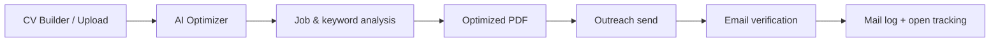

# CV AI Maker

AI-powered CV creation, company-targeted optimization, and job application outreach platform.

CV AI Maker strengthens your resume with Gemini, tailors it to job postings and companies, exports polished PDFs, and helps you manage application emails with verification and open tracking.

---

## Features

### AI CV Builder
- Interactive CV editor with personal info, experience, education, skills, and languages
- AI generation and improvement for summary, experience, and skills
- Live preview and PDF export (`@react-pdf/renderer`)
- Font size, language, and drag-and-drop editing support

### AI Optimizer (Company-based)
- Upload an existing CV (PDF text extraction)
- Job posting / company analysis
- Keyword-driven, company-specific CV optimization
- Preview, PDF attachment, and handoff to the outreach flow

### Outreach & Mail
- Send application emails with CV attachments to multiple recipients
- Pre-send email verification (Reacher + EmailVerify.io fallback)
- Daily limits, domain protection, and randomized send delays
- Outreach projects and mail logs
- Open tracking (tracking pixel)

### Account & Profile
- Sign up, sign in, JWT (access + refresh)
- Email verification and password reset
- Profile photo (Cloudinary)
- Dashboard overview and saved CVs

---

## Tech Stack

| Layer | Technologies |
|--------|----------------|
| **Frontend** | Next.js 15, React 19, TypeScript, MUI, `@react-pdf/renderer`, dnd-kit, pdf.js |
| **Backend** | Node.js, Express, Mongoose |
| **Database** | MongoDB |
| **AI** | Google Gemini (`gemini-2.5-flash`, key rotation) |
| **Other** | JWT, Nodemailer, Cloudinary, Reacher (Docker), EmailVerify.io |

---

## Project Structure

```
CV AI Maker/
├── Frontend/          # Next.js app (port 3010)
│   └── src/
│       ├── app/                 # App Router pages
│       ├── features/            # Feature modules (auth, ai-cv-builder, optimizer…)
│       ├── components/          # Shared UI & CV/PDF components
│       └── lib/                 # API clients, AI helpers, utilities
└── Backend/           # Express API (port 3001)
    └── src/
        ├── controllers/
        ├── routes/
        ├── services/
        ├── models/
        └── middlewares/
```

---

## Quick Start

### Prerequisites
- Node.js 18+
- MongoDB (local or Atlas)
- Docker Desktop *(for Reacher email verification; starts automatically with `npm run dev`)*
- Google Gemini API key
- SMTP credentials *(for email delivery)*
- Cloudinary account *(optional, for profile photos)*

### 1. Backend

```bash
cd Backend
cp .env.example .env
# Fill in the .env values
npm install
npm run dev
```

The API runs at `http://localhost:3001` by default. Health check: `GET /health`

### 2. Frontend

```bash
cd Frontend
npm install
npm run dev
```

App: [http://localhost:3010](http://localhost:3010)

- `npm run dev` → API `http://localhost:3011` (`.env.development`)
- `npm run build && npm start` → API `https://ai-cv-maker-3qcm.onrender.com` (`.env.production`)

> Local backend port comes from Backend `.env` (`PORT`). Keep `NEXT_PUBLIC_API_URL` in `.env.development` in sync with that port.

---

## Environment Variables (summary)

### Backend (`.env`)

| Variable | Description |
|----------|-------------|
| `MONGODB_URI` | MongoDB connection string |
| `JWT_SECRET` | Access/refresh token signing secret |
| `FRONTEND_URL` | Frontend URL for CORS and reset links |
| `SMTP_*` | Outbound email delivery |
| `GEMINI_API_KEY` (+ fallbacks) | Gemini keys (server-side only) |
| `REACHER_URL` | Self-hosted email verification |
| `EMAILVERIFY_API_KEY` | Reacher fallback |
| `OUTREACH_*` | Daily limit, delay, recipient cap |
| `TRACKING_PUBLIC_BASE_URL` | Public URL for the open-tracking pixel (prod / ngrok) |

Full list: [`Backend/.env.example`](Backend/.env.example)

### Frontend

| File | When | Value |
|------|------|--------|
| `.env.development` | `npm run dev` | `http://localhost:3011` |
| `.env.production` | `npm run build` / `npm start` | Render API URL |

```env
# .env.development
NEXT_PUBLIC_API_URL=http://localhost:3011

# .env.production
NEXT_PUBLIC_API_URL=https://ai-cv-maker-3qcm.onrender.com
```

`NEXT_PUBLIC_*` values are baked in at **build** time. After changing production URL, run `npm run build` again before `npm start`.

---

## Main Pages

| Route | Description |
|------|-------------|
| `/login`, `/register` | Authentication |
| `/dashboard` | Overview panel |
| `/my-cvs` | Saved CVs |
| `/my-cvs/ai-cv-builder/new` | New AI CV |
| `/company-based-cv-editor` | Company-based AI Optimizer |
| `/outreach-projects` | Outreach projects |
| `/outreach-logs` | Mail logs |
| `/mail-tracking` | Open tracking |
| `/profile` | Profile management |

---

## API Overview

| Prefix | Description |
|--------|-------------|
| `/api/auth` | Register, login, refresh, password reset |
| `/api/cvs` | CV CRUD |
| `/api/dashboard` | Dashboard data |
| `/api/ai` | Gemini proxy & token estimation |
| `/api/outreach` | Application email sending |
| `/api/outreach-projects` | Outreach projects |
| `/api/mail-tracking` | Mail tracking API |
| `/api/track` | Tracking pixel (no auth) |

---

## Typical Workflow



1. Create a CV or upload an existing PDF  
2. Analyze the job posting and optimize the CV for the company  
3. Preview / download the PDF  
4. Send applications via outreach (verification + limits)  
5. Monitor opens from the Mail Tracking screen  

---

## Development Notes

- Keep Gemini keys **on the Backend only**; do not expose them as `NEXT_PUBLIC_*` on the frontend.
- Local mail tracking needs a public URL (e.g. `ngrok http <PORT>` → `TRACKING_PUBLIC_BASE_URL`).
- Reacher: `npm run reacher:start` / `npm run reacher:stop` (or automatic via `npm run dev`).
- Frontend PDF ligature tests run with `npm test` / during `prebuild`.

---

## License

ISC

---

**CV AI Maker** — Build with AI, optimize for the company, track your applications.
